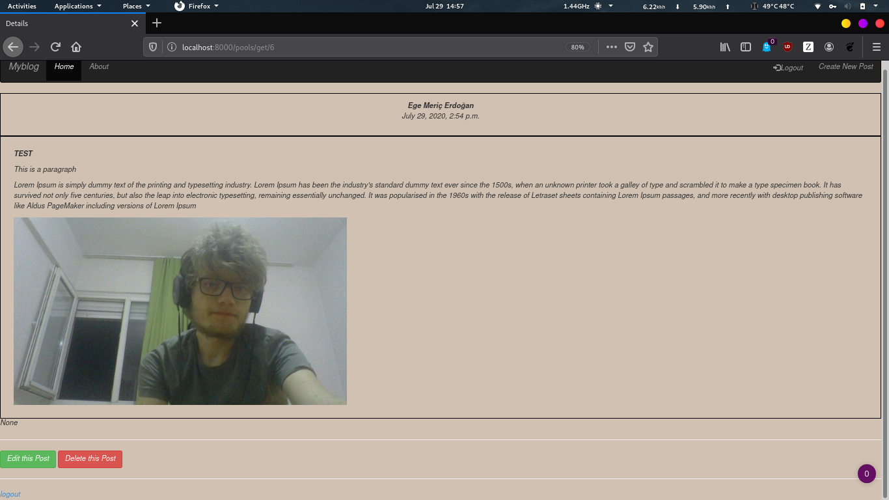

# Abaout Dj-Blog
I have tried to bulid a mini web content management system while my internship continues
It uses Python Django framework. And also, to understand RestApi system I have tried to use DjangoRestapi Framework
# Here is the some screenshots from web-app
 Sory for the Site style. It is awful I know :D
 ### Index Page
 #### 
 ### Login Page
 #### 
 ### Post Detail Page
 #### 
 ### Edit Post Page
 You can edit post here also you can use html tags in content area  
 And you can create new Post same Form format.
 #### 
 ### Rest Api Get All Content URL
 Rest api urls under  
 -> /pools/api/  
 For selected post you can use the post ID to retiiewe the content  
 -> /pools/api/get/2 (2 is content id)  
 #### 
 
 

